# Kafka Operations Agent

> An autonomous AI-powered SRE agent that monitors Apache Kafka consumer groups, detects lag anomalies, retrieves grounded context from a vector knowledge base, and generates risk-ranked scaling recommendations using Claude LLM — without human intervention.

<br>

```
┌─────────────────────────────────────────────────────────────────────────────────┐
│                        CAPABILITY HIGHLIGHTS                                     │
│                                                                                  │
│  Autonomous SRE    ·   RAG-Powered Reasoning   ·   Event-Driven Architecture   │
│  Vector Search     ·   LLM Tool Use (Claude)   ·   Full Observability Stack    │
│  5 Lag Patterns    ·   40 Historical Incidents  ·   Zero Human-in-the-Loop     │
└─────────────────────────────────────────────────────────────────────────────────┘
```

---

## Table of Contents

1. [Problem Statement](#1-problem-statement)
2. [Solution Overview](#2-solution-overview)
3. [End-to-End Architecture](#3-end-to-end-architecture)
4. [Agent Workflow](#4-agent-workflow)
5. [Execution Sequence Diagram](#5-execution-sequence-diagram)
6. [AI Agent Internals](#6-ai-agent-internals)
7. [RAG Architecture](#7-rag-architecture)
8. [Vector Store Design](#8-vector-store-design)
9. [Data Flow](#9-data-flow)
10. [Knowledge Base Design](#10-knowledge-base-design)
11. [Reasoning Loop](#11-reasoning-loop)
12. [Agent State Machine](#12-agent-state-machine)
13. [Error Handling & Reliability](#13-error-handling--reliability)
14. [Scalability Architecture](#14-scalability-architecture)
15. [Security Architecture](#15-security-architecture)
16. [Observability Stack](#16-observability-stack)
17. [Project Structure](#17-project-structure)
18. [Deployment Architecture](#18-deployment-architecture)
19. [Example Walkthrough](#19-example-walkthrough)
20. [Technical Highlights](#20-technical-highlights)
21. [Quick Start](#21-quick-start)
22. [Future Roadmap](#22-future-roadmap)

---

## 1. Problem Statement

### The Challenge of Kafka Operations at Scale

Apache Kafka powers mission-critical pipelines at millions of messages per second. When a consumer group stalls, a partition becomes a hotspot, or lag begins growing unbounded, the window to intervene is measured in **minutes — not hours**.

```
Traditional On-Call Response                  AI Agent Response
─────────────────────────────                 ──────────────────
Alert fires at 2 AM          ──── vs ────     Detected at t+0s
Engineer paged               (8-15 min)       Context retrieved at t+2s
Engineer investigates        (10-30 min)      Root cause identified at t+5s
Runbook located              (5-15 min)       Recommendations generated at t+6s
Action taken                 (5-10 min)       Events published at t+7s
Total: 28–70 minutes                          Total: < 10 seconds
```

### Why Traditional Systems Fail

| Problem | Traditional Approach | Failure Mode |
|---|---|---|
| Consumer lag spike | Threshold alert → PagerDuty | Alert fatigue, false positives |
| Partition hotspots | Manual `kafka-topics.sh` inspection | Slow, error-prone |
| Root cause analysis | Engineer reads runbooks | Knowledge varies by engineer |
| Historical context | Tribal knowledge | Lost when engineers leave |
| Scaling decisions | Gut feel + experience | Inconsistent, risky |

### Why an AI Agent Solves This

- **Continuous observation** — polls every 60 seconds, never sleeps
- **Grounded recommendations** — every decision cites a runbook or historical incident
- **Velocity-aware** — detects *rate of change* in lag, not just threshold breaches
- **Pattern recognition** — classifies 5 distinct lag failure modes with distinct remediation paths
- **Confidence scoring** — communicates uncertainty so operators can prioritize review

---

## 2. Solution Overview

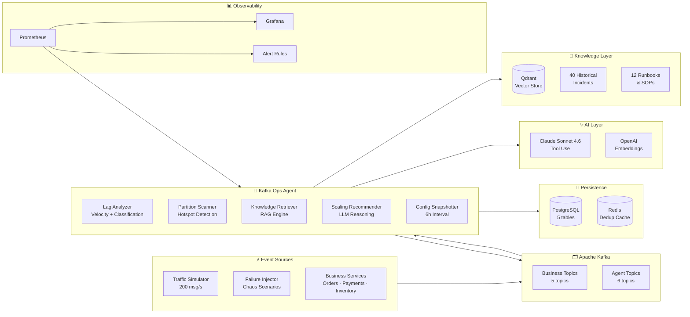

---

## 3. End-to-End Architecture

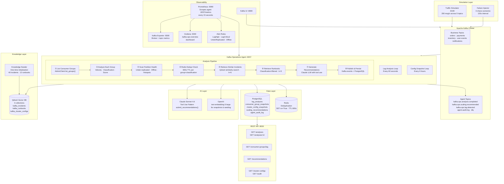

---

## 4. Agent Workflow

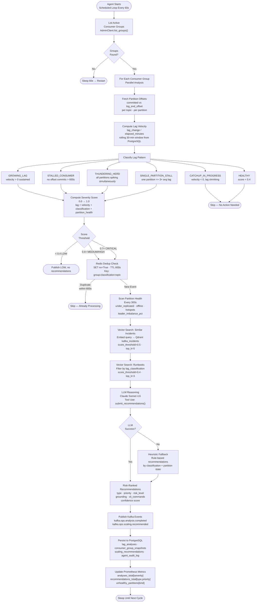

---

## 5. Execution Sequence Diagram

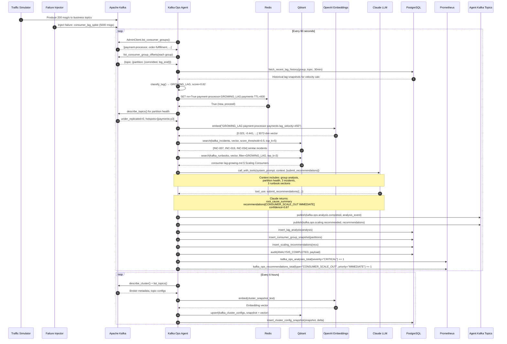

---

## 6. AI Agent Internals

### Component Responsibilities

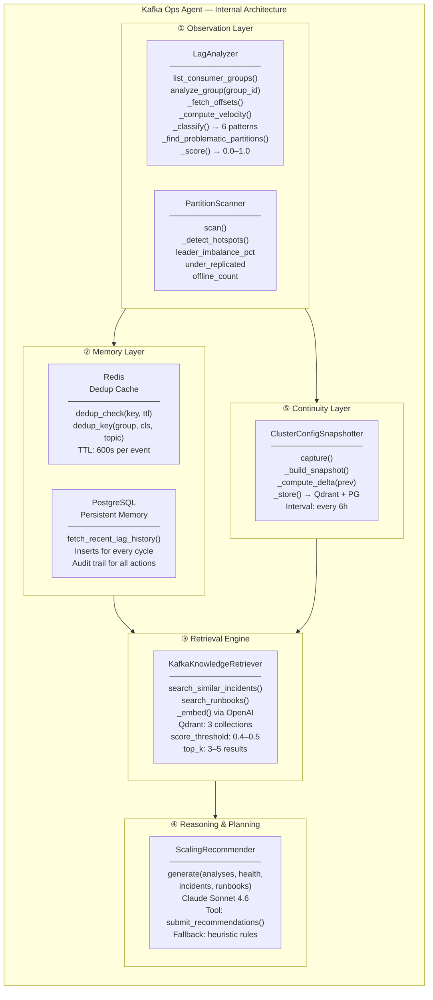

### Lag Classification Engine

The `LagAnalyzer` implements a deterministic scoring and classification system that maps raw Kafka metrics into semantically meaningful states:

```
Input Signals                  Classification Logic                  Output
──────────────                 ────────────────────                  ──────
committed_offset               velocity > 0 for N cycles             GROWING_LAG
log_end_offset           ───►  no commits for > 600s          ───►   STALLED_CONSUMER
lag history (30 min)           velocity < 0 (recovering)             CATCHUP_IN_PROGRESS
partition_count                all partitions spike together          THUNDERING_HERD
member_count                   one partition >> 3× average           SINGLE_PARTITION_STALL
                               score < 0.4                           HEALTHY
```

**Scoring Formula:**

```
severity_score = f(
    lag_ratio        = min(total_lag / MAX_LAG_REFERENCE, 1.0),
    velocity_factor  = tanh(lag_velocity_per_min / 10_000),
    classification   = {STALLED: +0.3, GROWING: +0.2, THUNDERING_HERD: +0.25, ...},
    partition_health = under_replicated_count × 0.1 + offline_count × 0.2
)

Thresholds:
  LOW      score < 0.4
  MEDIUM   0.4 ≤ score < 0.7
  HIGH     0.7 ≤ score < 0.85   (inferred from CRITICAL boundary)
  CRITICAL score ≥ 0.7
```

### LLM Tool Contract

Claude receives a structured context object and must call exactly one tool:

```json
{
  "name": "submit_recommendations",
  "description": "Submit risk-ranked scaling recommendations",
  "input_schema": {
    "root_cause_summary": "string",
    "confidence": "float (0.0–1.0)",
    "recommendations": [{
      "recommendation_type": "CONSUMER_RESTART | CONSUMER_SCALE_OUT | PARTITION_REBALANCE | TOPIC_PARTITION_INCREASE | BROKER_SCALE | MESSAGE_SKIP | CONFIG_CHANGE | PREFERRED_REPLICA_ELECTION | BROKER_HEALTH_CHECK",
      "priority": "IMMEDIATE | WITHIN_15MIN | WITHIN_1HOUR | ADVISORY",
      "risk_level": "LOW | MEDIUM | HIGH | CRITICAL",
      "grounding": "RUNBOOK | HISTORICAL_INCIDENT | HEURISTIC_ONLY",
      "rationale": "string",
      "consumer_group": "string | null",
      "topic": "string | null",
      "estimated_resolution_minutes": "integer",
      "cli_commands": ["string"]
    }]
  }
}
```

---

## 7. RAG Architecture

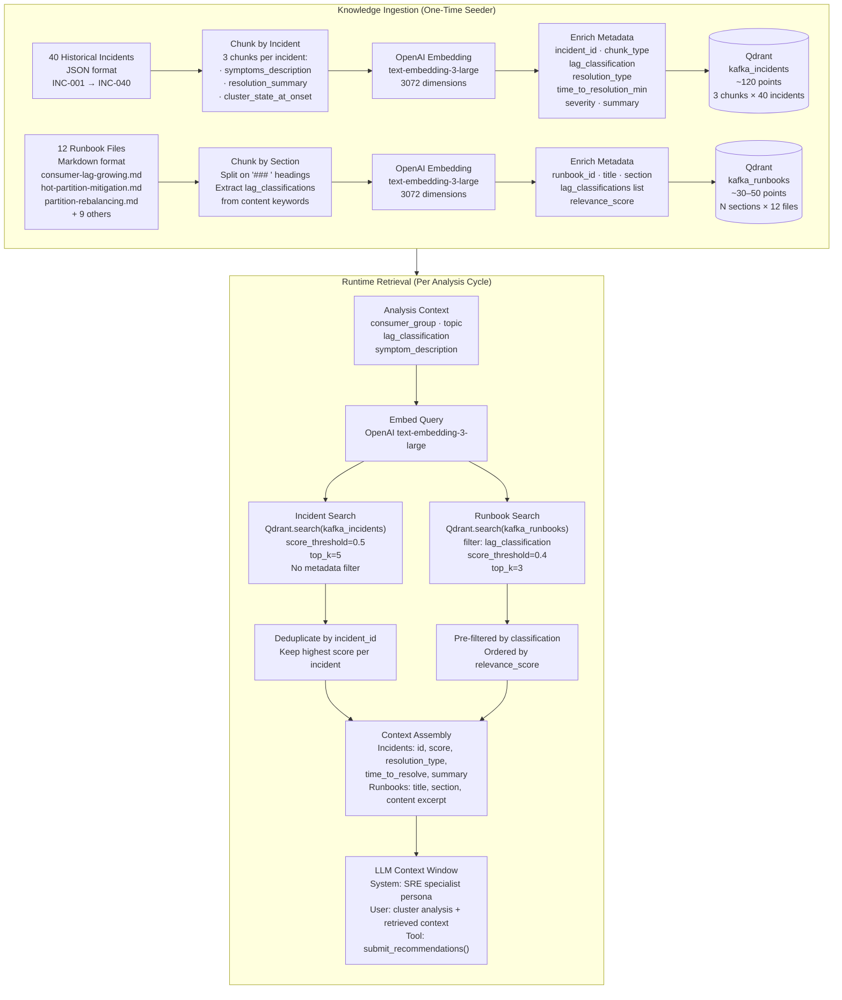

---

## 8. Vector Store Design

### Qdrant Collection Schema

```
Collection: kafka_incidents
─────────────────────────────────────────────────────────────────────────────
Vector:    3072-dim float32  (text-embedding-3-large)
Distance:  Cosine similarity

Payload Schema:
{
  "incident_id":                "INC-007",
  "chunk_type":                 "symptoms_description" | "resolution_summary" | "cluster_state_at_onset",
  "consumer_group":             "payment-processor",
  "topic":                      "payments",
  "lag_classification":         "GROWING_LAG",
  "resolution_type":            "CONSUMER_SCALE_OUT",
  "time_to_resolution_minutes": 23,
  "severity":                   "HIGH",
  "summary":                    "Payment processor fell behind during end-of-month billing..."
}

Index:    lag_classification (keyword, for filter pushdown)


Collection: kafka_runbooks
─────────────────────────────────────────────────────────────────────────────
Vector:    3072-dim float32
Distance:  Cosine similarity

Payload Schema:
{
  "runbook_id":         "consumer-lag-growing",
  "title":              "Consumer Lag Growing Runbook",
  "section":            "Scaling Consumers",
  "content":            "Full markdown section text...",
  "lag_classifications": ["GROWING_LAG", "THUNDERING_HERD"],
  "relevance_score":    0.91
}

Index:    lag_classifications (keyword array, for filter pushdown)


Collection: kafka_cluster_configs
─────────────────────────────────────────────────────────────────────────────
Vector:    3072-dim float32
Distance:  Cosine similarity

Payload Schema:
{
  "snapshot_at":     "2024-01-15T14:30:00Z",
  "broker_count":    3,
  "topics":          {...},
  "consumer_groups": {...},
  "change_delta":    {...}
}
```

### Document Ingestion Pipeline

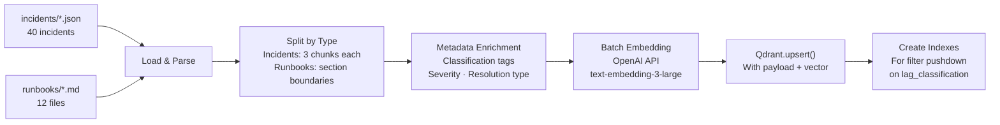

---

## 9. Data Flow

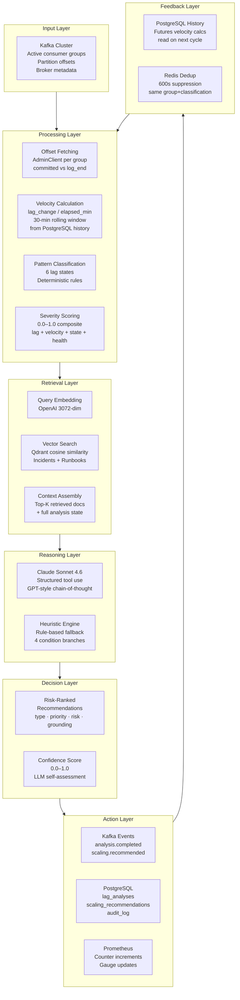

---

## 10. Knowledge Base Design

### Structure

```
knowledge/
├── incidents/
│   └── historical_incidents.json     # 40 real-world Kafka incidents
│                                       # INC-001 → INC-040
│                                       # Classifications: all 6 lag patterns
│                                       # Resolutions: 9 action types
│                                       # Time-to-resolve: 5–240 minutes
│
└── runbooks/
    ├── consumer-lag-growing.md        # GROWING_LAG mitigation SOP
    ├── hot-partition-mitigation.md    # Hotspot detection & remediation
    ├── partition-rebalancing.md       # Preferred replica election
    ├── broker-leader-rebalance.md     # Leader distribution balancing
    ├── compaction-lag-debug.md        # Log compaction lag debugging
    ├── consumer-group-reset.md        # Offset reset procedures
    ├── consumer-thread-deadlock.md    # Consumer thread stall recovery
    ├── network-partition-recovery.md  # Split-brain recovery
    ├── stalled-consumer-detection.md  # STALLED_CONSUMER playbook
    ├── thundering-herd-response.md    # THUNDERING_HERD response
    ├── topic-partition-increase.md    # Partition scaling procedures
    └── under-replicated-recovery.md  # ISR rebuild procedures
```

### Incident Coverage Matrix

| Classification | Incidents | Resolutions Available |
|---|---|---|
| `GROWING_LAG` | 15 | CONSUMER_SCALE_OUT, CONFIG_CHANGE, TOPIC_PARTITION_INCREASE |
| `STALLED_CONSUMER` | 12 | CONSUMER_RESTART, MESSAGE_SKIP, CONFIG_CHANGE |
| `THUNDERING_HERD` | 6 | CONSUMER_SCALE_OUT, PARTITION_REBALANCE |
| `SINGLE_PARTITION_STALL` | 4 | CONSUMER_RESTART, MESSAGE_SKIP |
| `CATCHUP_IN_PROGRESS` | 3 | ADVISORY only |
| Partition Health | 40 incidents total | BROKER_HEALTH_CHECK, PREFERRED_REPLICA_ELECTION, BROKER_SCALE |

### Knowledge Retrieval Flow

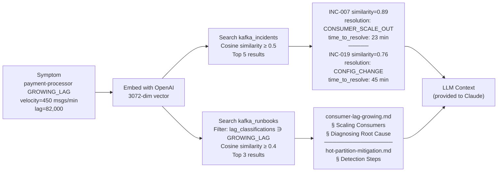

---

## 11. Reasoning Loop

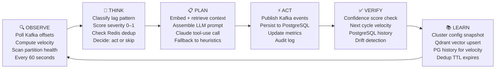

The agent follows an **Observe → Think → Plan → Act → Verify → Learn** cycle that repeats every 60 seconds for lag analysis and every 6 hours for knowledge enrichment.

---

## 12. Agent State Machine

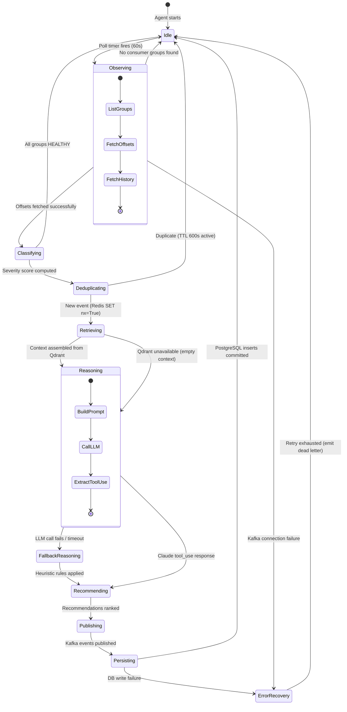

---

## 13. Error Handling & Reliability

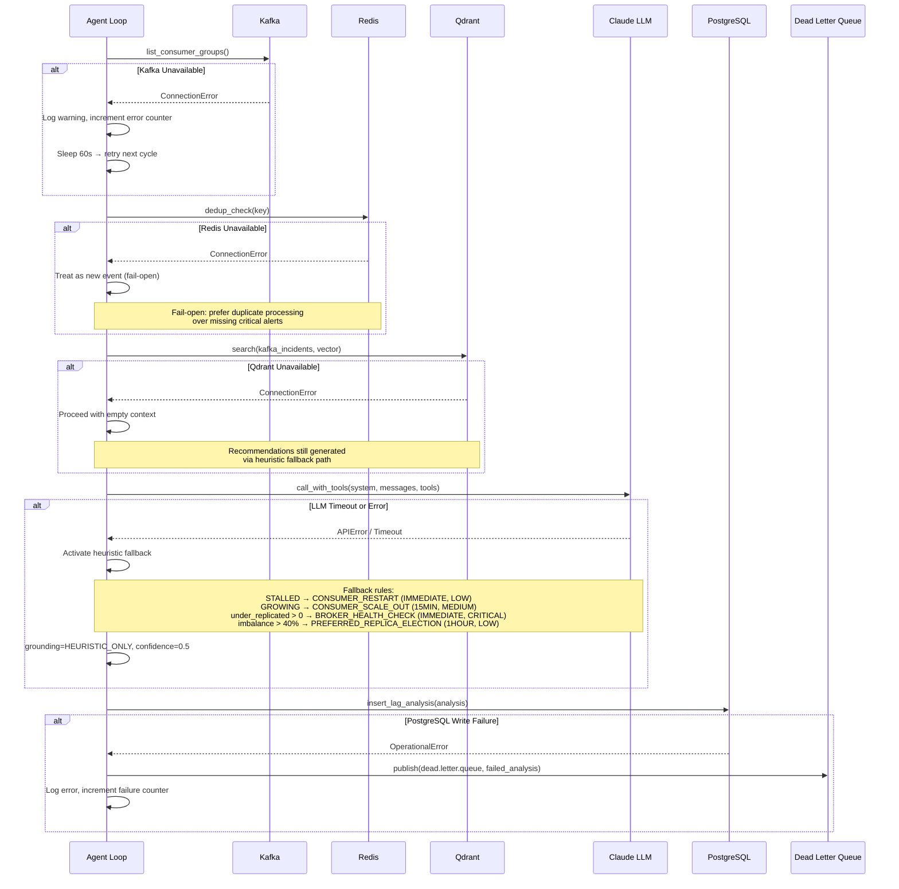

### Reliability Properties

| Property | Implementation |
|---|---|
| Deduplication | Redis SET nx=True with 600s TTL prevents duplicate recommendation storms |
| Graceful degradation | LLM failure → heuristic fallback, Qdrant failure → empty context, Redis failure → fail-open |
| Audit trail | Every agent action written to `agent_audit_log` table in PostgreSQL |
| Dead letter queue | `dead.letter.queue` Kafka topic for failed analysis events |
| Idempotency | `analysis_id` UUID generated per cycle; PostgreSQL UPSERT-safe schema |

---

## 14. Scalability Architecture

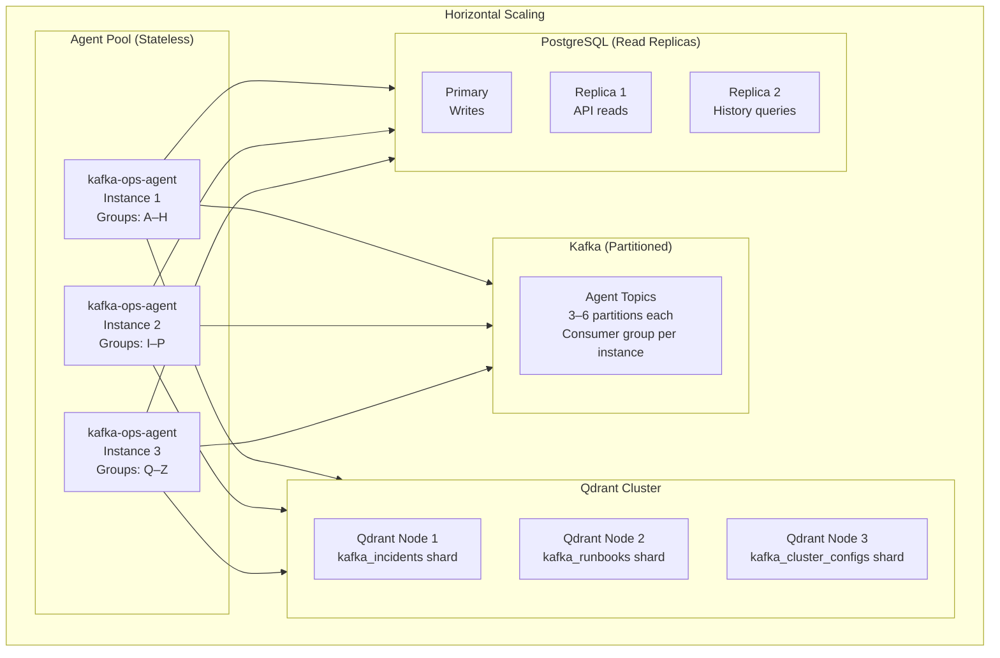

### Scalability Properties

| Dimension | Current | Scale-Out Path |
|---|---|---|
| Consumer groups monitored | Bounded by 60s loop | Partition groups across agent instances |
| Kafka throughput | 200 msg/s (simulator) | Kafka partition increase + consumer scale-out |
| Vector search latency | Single Qdrant node | Qdrant distributed cluster with sharding |
| LLM concurrency | Sequential per group | Async batch calls with rate limiting |
| API read throughput | Single PostgreSQL | Read replicas + connection pooling |
| Config snapshot storage | Unlimited (Qdrant) | TTL-based eviction of old snapshots |

---

## 15. Security Architecture

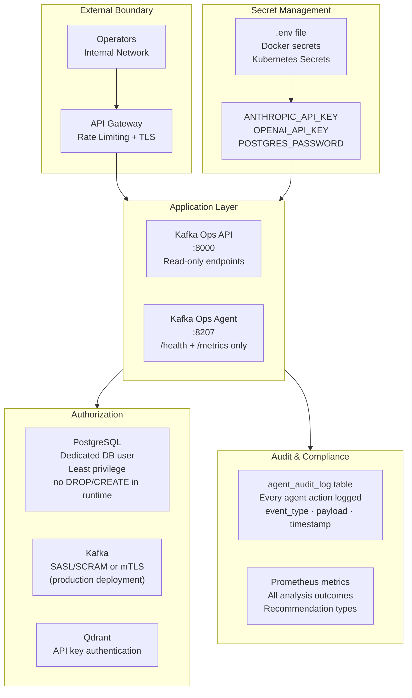

| Security Control | Implementation |
|---|---|
| API keys | Environment variables, never in source code; `.env.example` provided |
| Network isolation | All services on Docker bridge network; only ports explicitly exposed |
| Least privilege | PostgreSQL user scoped to `kafka_ops` DB with DML only |
| Audit logging | All agent decisions written to `agent_audit_log` with full payload |
| Secret rotation | API keys externalized to environment; no restart required for Postgres password rotation |
| Input validation | LLM output parsed via typed Pydantic schema; invalid tool calls rejected |

---

## 16. Observability Stack

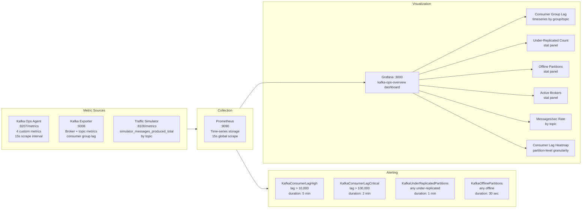

### Agent-Emitted Metrics

| Metric | Type | Labels | Description |
|---|---|---|---|
| `kafka_ops_analyses_total` | Counter | `severity` | Total analysis cycles by severity |
| `kafka_ops_recommendations_total` | Counter | `type`, `priority` | Recommendations generated |
| `kafka_ops_consumer_groups_monitored` | Gauge | — | Active groups under observation |
| `kafka_ops_unhealthy_partitions` | Gauge | `kind` | under_replicated or offline count |

---

## 17. Project Structure

```
kafka-ops-agent/
│
├── agents/                             # Agent runtime code
│   ├── kafka_ops/                      # Main agent service
│   │   ├── src/
│   │   │   ├── main.py                 # Entry point: HTTP server + analysis loops
│   │   │   ├── lag_analyzer.py         # Velocity calc, classification, scoring
│   │   │   ├── partition_scanner.py    # Under-replicated, offline, hotspot detection
│   │   │   ├── kafka_knowledge_retriever.py  # RAG engine: Qdrant + OpenAI
│   │   │   ├── scaling_recommender.py  # Claude LLM tool-use for recommendations
│   │   │   └── cluster_config_snapshotter.py # 6h cluster state capture
│   │   ├── requirements.txt
│   │   └── Dockerfile
│   │
│   └── shared/                         # Shared client libraries
│       ├── kafka_client.py             # Producer, consumer, admin client factory
│       ├── llm_client.py               # Anthropic SDK wrapper (tool-use + text)
│       ├── models.py                   # All Pydantic models and enums
│       ├── postgres_client.py          # Connection pool, CRUD operations
│       └── redis_client.py             # Dedup cache operations
│
├── application/                        # REST API service
│   └── kafka-ops-api/
│       ├── src/
│       │   └── main.py                 # FastAPI: 6 read-only endpoints
│       ├── requirements.txt
│       └── Dockerfile
│
├── knowledge/                          # Knowledge base for RAG
│   ├── incidents/
│   │   └── historical_incidents.json   # 40 real Kafka incidents (INC-001–INC-040)
│   ├── runbooks/                       # 12 operational runbooks (.md)
│   │   ├── consumer-lag-growing.md
│   │   ├── hot-partition-mitigation.md
│   │   ├── partition-rebalancing.md
│   │   └── ... (9 more runbooks)
│   └── seeder/                         # One-time Qdrant initialization
│       ├── src/main.py                 # Chunks, embeds, and upserts all knowledge
│       ├── requirements.txt
│       └── Dockerfile
│
├── infrastructure/                     # Infrastructure configuration
│   ├── kafka/
│   │   ├── topics.json                 # 11 topic definitions (5 biz + 6 agent)
│   │   └── create-topics.sh            # Topic provisioning script
│   ├── postgres/
│   │   └── init.sql                    # 5-table schema with indexes
│   ├── prometheus/
│   │   ├── prometheus.yml              # Scrape config (3 targets)
│   │   └── alert-rules.yml             # 4 alert rules
│   └── grafana/
│       ├── dashboards/
│       │   └── kafka-ops-overview.json # 6-panel Grafana dashboard
│       └── datasources/
│           └── prometheus.yml          # Grafana datasource config
│
├── simulation/                         # Load generation & chaos testing
│   ├── traffic-simulator/
│   │   ├── src/main.py                 # 200 msg/s across 5 topics
│   │   ├── requirements.txt
│   │   └── Dockerfile
│   └── failure-injector/
│       ├── src/
│       │   ├── main.py                 # Scheduled failure injection (120s)
│       │   └── failure_scenarios.py    # 3 chaos scenarios
│       ├── requirements.txt
│       └── Dockerfile
│
├── docker-compose.yml                  # Full stack: 15 services
├── Makefile                            # Developer workflows
├── .env.example                        # Required environment variables
└── README.md
```

---

## 18. Deployment Architecture

### Local / Docker Compose

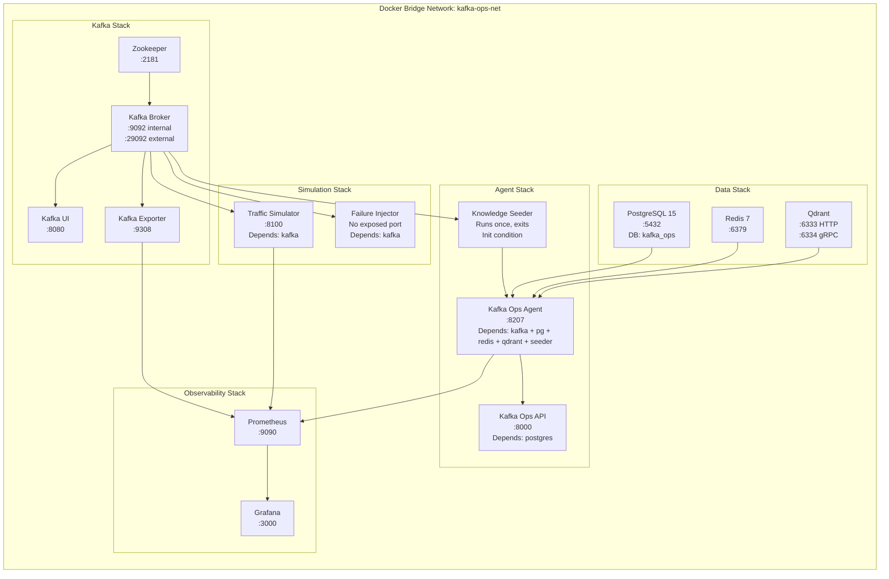

### Kubernetes Deployment (Production Target)

```
Namespace: kafka-ops
─────────────────────────────────────────────────────────────────
Deployments:
  kafka-ops-agent       replicas: 2–5 (HPA on CPU + custom metric)
  kafka-ops-api         replicas: 2–3 (HPA on request rate)
  knowledge-seeder      Job (run-once, init container pattern)

StatefulSets:
  kafka                 replicas: 3 (KRaft mode, no Zookeeper)
  qdrant                replicas: 3 (distributed mode)
  postgresql            replicas: 1 primary + 2 replicas

Services:
  kafka-ops-agent       ClusterIP :8207 (metrics scraping)
  kafka-ops-api         LoadBalancer :8000 (external)
  kafka                 ClusterIP :9092
  qdrant                ClusterIP :6333
  postgresql            ClusterIP :5432

ConfigMaps:
  agent-config          LAG_POLL_INTERVAL, PARTITION_SCAN_INTERVAL, etc.

Secrets:
  api-keys              ANTHROPIC_API_KEY, OPENAI_API_KEY
  db-credentials        POSTGRES_PASSWORD

HPA Rules:
  kafka-ops-agent       min=2, max=10, targetCPU=70%, scale on consumer group count
```

---

## 19. Example Walkthrough

**Scenario:** Black Friday traffic causes payment processor consumer group to fall behind by 82,000 messages at a velocity of 450 messages per minute.

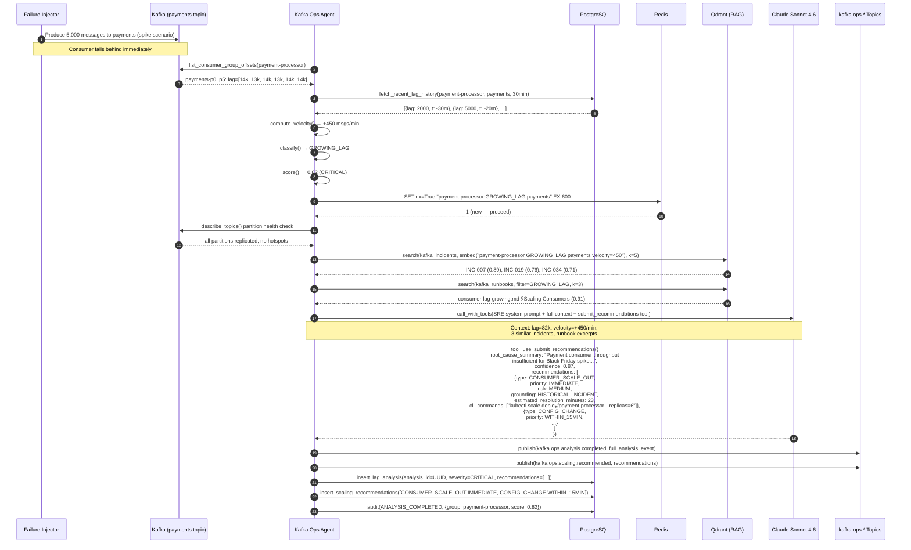

**Outcome:** Within ~8 seconds of the lag spike being detectable, the agent has published a grounded, confidence-scored recommendation to scale out the payment-processor consumer group — citing INC-007 where the same resolution took 23 minutes to implement and fully resolved the issue.

---

## 20. Technical Highlights

<details>
<summary><strong>Distributed Systems Design</strong></summary>

- **Event-driven decoupling:** Agent communicates results via Kafka topics (`kafka.ops.analysis.completed`, `kafka.ops.scaling.recommended`), enabling downstream consumers without coupling
- **Idempotent processing:** Analysis IDs are UUIDs generated per cycle; PostgreSQL schema is designed for safe re-insertion
- **Distributed deduplication:** Redis-based dedup with 600s TTL prevents recommendation storms across restarts
- **Dead letter queue:** Failed analysis events routed to `dead.letter.queue` for replay

</details>

<details>
<summary><strong>AI Orchestration & LLM Patterns</strong></summary>

- **Structured tool use:** LLM constrained to call exactly one tool (`submit_recommendations`) with a typed JSON schema — outputs are machine-parseable, not free-text
- **Grounding taxonomy:** Every recommendation tagged with `grounding ∈ {RUNBOOK, HISTORICAL_INCIDENT, HEURISTIC_ONLY}` so operators know the evidence quality
- **Graceful LLM fallback:** Deterministic heuristic engine activates on any LLM failure, ensuring recommendations are always produced
- **Confidence propagation:** LLM self-reports confidence (0–1); surfaced in API and events so downstream consumers can threshold-filter

</details>

<details>
<summary><strong>RAG Architecture</strong></summary>

- **Multi-collection retrieval:** Separate Qdrant collections for incidents, runbooks, and cluster configs — different schemas, different retrieval strategies, different score thresholds
- **Metadata filtering:** Runbook search pre-filtered by `lag_classification` in Qdrant payload index, reducing false positives
- **Deduplication on retrieval:** Incident results deduplicated by `incident_id` before LLM context assembly
- **Embedding model selection:** `text-embedding-3-large` (3072-dim) chosen for domain-specific semantic similarity over smaller alternatives

</details>

<details>
<summary><strong>Observability & Reliability Engineering</strong></summary>

- **RED metrics:** Rate (analyses_total), Errors (agent error counter), Duration (implicit in cycle time)
- **Custom Prometheus metrics:** Agent exports 4 typed metrics with meaningful labels; no generic framework metrics
- **Velocity-aware alerting:** Alert rules operate on rates of change, not just static thresholds
- **Full audit trail:** Every agent decision persisted to `agent_audit_log` with payload — enables post-hoc review and model improvement
- **Multi-layer health checks:** Agent `/health` endpoint, Docker health checks, PostgreSQL connectivity validation on startup

</details>

<details>
<summary><strong>Domain Engineering</strong></summary>

- **6-way lag classification:** Pattern recognizer distinguishes GROWING vs STALLED vs THUNDERING_HERD vs SINGLE_PARTITION_STALL — each has a distinct remediation path
- **Composite severity scoring:** Multi-factor scoring function combining lag magnitude, velocity, pattern severity, and partition health — not a simple threshold
- **Velocity calculation:** Rolling 30-minute lag history from PostgreSQL used to compute first derivative of lag — detects trends early, before thresholds are breached
- **40-incident knowledge base:** Curated historical incidents span all 6 lag classifications and 9 resolution types — provides diverse retrieval coverage

</details>

<details>
<summary><strong>Operational Excellence</strong></summary>

- **Repeatable environments:** Full stack in docker-compose with health-check-based startup ordering (seeder → agent → api)
- **Configuration-driven behavior:** Every tunable parameter externalized as environment variable with sensible defaults
- **Chaos engineering:** Built-in failure injector with 3 scenarios (lag spike, single partition stall, thundering herd) for continuous validation
- **Knowledge seeder pattern:** Separate service initializes vector DB once on startup — idempotent, reruns safely

</details>

---

## 21. Quick Start

### Prerequisites

- Docker & Docker Compose
- `ANTHROPIC_API_KEY` (Claude API)
- `OPENAI_API_KEY` (embeddings)

### Setup

```bash
# Clone the repository
git clone https://github.com/amudhan023/kafka-ops-agent
cd kafka-ops-agent

# Configure environment
cp .env.example .env
# Edit .env with your API keys

# Start the full stack
make up

# Or directly with Docker Compose
docker compose up -d
```

### Service Endpoints

| Service | URL | Description |
|---|---|---|
| Kafka Ops Agent | http://localhost:8207/health | Agent health + metrics |
| Kafka Ops API | http://localhost:8000/analyses | Analysis results |
| Kafka UI | http://localhost:8080 | Topic + consumer group browser |
| Grafana | http://localhost:3000 | `kafka-ops-overview` dashboard |
| Prometheus | http://localhost:9090 | Raw metrics + alert status |
| Qdrant UI | http://localhost:6333/dashboard | Vector store browser |

### Watch the Agent Work

```bash
# Tail agent logs
docker compose logs -f kafka-ops-agent

# Trigger a failure scenario immediately
docker compose exec failure-injector python -c "
from failure_scenarios import scenario_consumer_lag_spike
scenario_consumer_lag_spike().apply()
"

# Query latest analyses
curl http://localhost:8000/analyses?limit=5 | jq .

# Query latest recommendations
curl http://localhost:8000/recommendations?limit=10 | jq .

# View Prometheus metrics
curl http://localhost:8207/metrics | grep kafka_ops
```

### Makefile Targets

```bash
make up          # Start all services
make down        # Stop all services
make logs        # Follow agent logs
make ps          # Show service status
make seed        # Re-run knowledge seeder
make clean       # Remove volumes and reset state
```

---

## 22. Future Roadmap

### Near Term

- [ ] **Human-in-the-loop approval gate** — High-risk recommendations (`CRITICAL` risk level) routed to Slack for operator confirmation before publishing
- [ ] **Multi-broker cluster support** — Extend partition scanner to report per-broker load distribution and detect broker-level hotspots
- [ ] **Recommendation feedback loop** — Track whether applied recommendations resolved the issue; feed outcomes back into incident knowledge base
- [ ] **gRPC streaming API** — Real-time analysis event streaming for low-latency operator dashboards

### Medium Term

- [ ] **Multi-cluster support** — Agent monitors multiple Kafka clusters with per-cluster configuration namespacing
- [ ] **LLM evaluation harness** — Automated regression testing of recommendation quality using historical incidents as ground truth
- [ ] **Kubernetes operator** — CRD-based deployment model; agent auto-discovers consumer groups from cluster annotations
- [ ] **Vector store versioning** — Knowledge base versions tied to git tags; rollback support for incident and runbook updates

### Long Term

- [ ] **Active remediation** — Agent executes approved recommendations directly via Kubernetes API and Kafka Admin API (not just publish)
- [ ] **Predictive lag detection** — Time-series forecasting on lag velocity to predict threshold breaches 15–30 minutes in advance
- [ ] **Cross-cluster incident correlation** — Detect cascading failures across multiple Kafka clusters from shared upstream producers
- [ ] **Self-improving knowledge base** — Resolved incidents automatically chunked, embedded, and added to Qdrant after operator confirmation

---

<details>
<summary><strong>Architecture Decision Records</strong></summary>

**ADR-001: Claude Tool Use over Free-Text Parsing**
LLM output constrained to a typed JSON schema via Anthropic tool use API. Avoids fragile regex/JSON parsing of free-text responses. Fallback to heuristics on tool call failure ensures reliability.

**ADR-002: OpenAI Embeddings for RAG, Claude for Reasoning**
`text-embedding-3-large` produces higher-quality semantic embeddings for domain-specific Kafka terminology than Claude's native embeddings. Claude Sonnet 4.6 used only for reasoning where its instruction-following and tool-use capabilities provide value.

**ADR-003: Redis for Deduplication over Kafka Consumer Group Offsets**
600s TTL dedup in Redis is simpler and more reliable than offset-based dedup for time-windowed suppression. Fail-open behavior (Redis down → treat as new) preferred over missing critical alerts.

**ADR-004: PostgreSQL for Persistence over Pure Kafka Log**
Analysis results require complex queries (group by severity, filter by consumer group, time-range scans for velocity). Kafka topic compaction insufficient for these access patterns. PostgreSQL with appropriate indexes provides sub-10ms query latency for the API layer.

**ADR-005: Separate Knowledge Seeder Service**
Embedding generation is expensive and slow. Running it as a one-time init job decouples knowledge base setup from agent startup. Seeder is idempotent and can be re-run to update knowledge without agent downtime.

</details>

---

<br>

```
Built with Apache Kafka · Anthropic Claude · OpenAI Embeddings · Qdrant · PostgreSQL · Redis · Prometheus · Grafana
```
